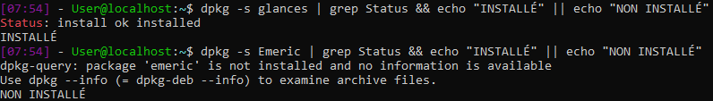

# **Exercice 1. Commandes de base**

1 - Pour mettre à jour le système, on va utiliser les commandes **sudo apt-get update** et **sudo apt-get upgrade**.

2 - A l'aide de nano on ouvre le fichier .bashrc puis dans la partie des alias, on ajoute la ligne suivante: **alias maj='sudo apt-get update && sudo apt-get upgrade'**. Une fois ajoutée, on quitte en sauvegardant le fichier. Enfin on exécute la commande **source .bashrc** pour prendre en compte les modifications sans avoir à redémarrer le serveur. Ce sont ces étapes qui permettent de sauvegarder l'alias pour pas qu'il ne soit perdu au prochain démarrage.

3 - Afin d'obtenir les 5 derniers paquets installés sur la machine, on tape la commande **cat /var/log/dpkg.log | tail -5**. Pour afficher les paquets installés, il est également possible d'utiliser la commande **dpkg -l**.

4 - Les paquets installés explicitement avec la commande **apt install** sont visibles avec **dpkg -L apt install**.

5 - **dpkg -l | wc -l** qui donne 623 et **apt list --installed | wc -l** qui donne 616.

6 - Avec la commande **apt list | wc -l** on obtient un total de 68953 paquets disponibles en téléchargement.

7 -
* Le paquet glances: application en ligne de commande qui permet d'afficher l'état des principales ressources d'un système, de sa charge du fonctionnement des applications. **sudo apt-get install glances**
* Le paquet tldr: Les pages tldr sont un effort communautaire pour simplifier les pages de manuel bien-aimées avec des exemples pratiques. **sudo apt-get install -y tldr**
* Le paquet hollywood: Cet utilitaire divisera votre console en plusieurs volets d'authentiques technobabble, parfaitement adapté à tout mélodrame geek hollywoodien. Il est particulièrement adapté sur n'importe quel nombre de consoles informatiques dans le arrière-plan de tout excellent technothriller schlock. En d'autres termes, cela permet de simuler une fenêtre de hacking comme au cinéma. **sudo apt-get install hollywood**. (c'est stylé)

8 - Il existe plusieurs paquets pour pouvoir jouer au sudoku, tels que sudoku, gnome-sudoku, ksudoku, sudoku-solver.

# **Exercice 2.**

**dpkg -S ls** est une commande qui permet de trouver le paquet qui a installé la commande ls. On peut obtenir cette information en une seule commande: **dpkg -S $(which -a ls)** ou **which -a ls | xargs dpkg -S**.
* **cd script**
* **touch origine-commande**
* **nano**
```ruby
#!/bin/bash

find_package()
{
        dpkg -S $(which -a $1);
}

find_package $1;

echo $0;
```

# **Exercice 3.**

En utilisant la commande **dpkg** on peut spécifier -s pour trouver le status d'un paquet. Donc, via la commande **dpkg -s [paquet] | grep Status** récupère le status du paquet. On peut ensuite vérifier si ce status existe ou non. La commande **dpkg -s [paquet] | grep Status && echo "INSTALLÉ" || echo "NON INSTALLÉ"** va afficher installé si le paquet est installé ou non installé si le paquet n'est pas installé.
exemple:

